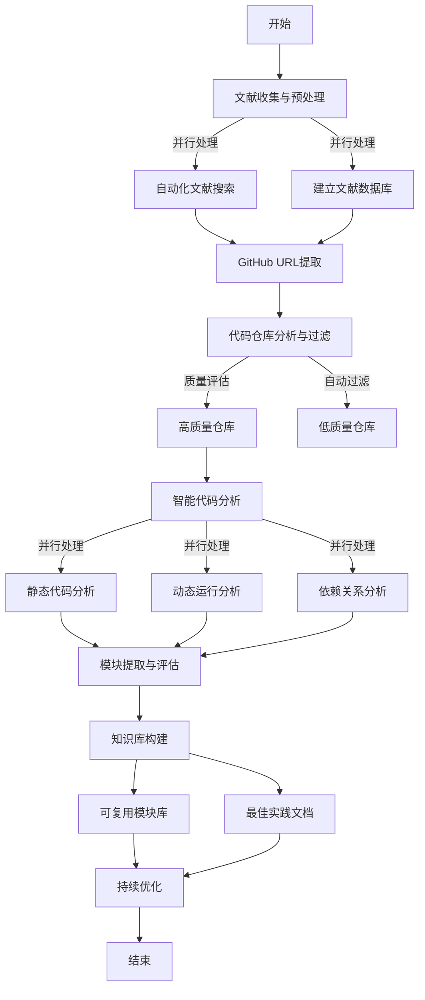
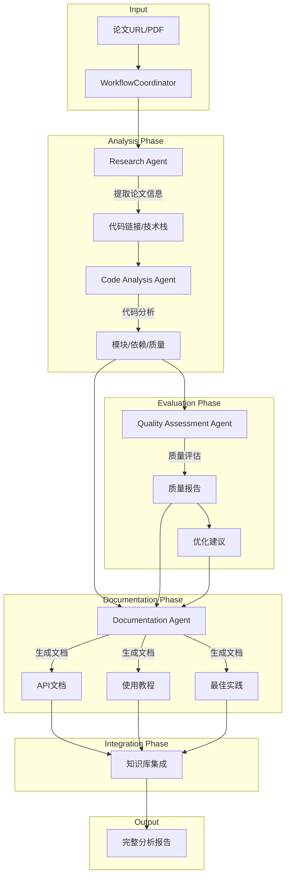

# SecuriPaperBot: 安全顶会论文分析框架

## 📚 概述

SecuriPaperBot 是一个专为计算机信息安全领域设计的智能论文分析框架，集成了自动化爬虫和深度代码分析功能。该框架支持从四大安全顶会（IEEE S&P、NDSS、ACM CCS、USENIX Security）自动获取论文，并进行深入的代码分析和知识提取。

## ✨ 核心功能

### 1. 论文获取
- 支持四大顶会论文自动下载
  - IEEE Symposium on Security and Privacy (IEEE S&P)
  - Network and Distributed System Security Symposium (NDSS)
  - ACM Conference on Computer and Communications Security (ACM CCS)
  - USENIX Security Symposium
- 智能文件名处理和元数据提取
- 支持机构VPN和代理配置

### 2. 代码分析
- 自动提取论文中的代码仓库链接
- 深度代码质量分析
- 可复用模块识别
- 安全漏洞检测
- 最佳实践提取

### 3. 知识库构建
- 自动生成API文档
- 构建代码复用库
- 漏洞模式总结
- 攻防技术归纳

## 🛠 系统要求

### 基础环境
- Python 3.8+
- 机构VPN或代理（用于访问ACM/IEEE数据库）
- Git

### Python依赖
```bash
# 基础依赖
pip install requests lxml urllib3

# 分析框架依赖
pip install paper-analysis-framework[security]
```

## 📦 安装指南

### 方法1：使用pip安装
```bash
pip install securipaperbot
```

### 方法2：从源码安装
```bash
git clone https://github.com/yourusername/securipaperbot.git
cd securipaperbot
pip install -e .
```

## 🚀 快速开始

### 1. 配置环境
```bash
# 设置API密钥
export OPENAI_API_KEY=your_api_key
export GITHUB_TOKEN=your_github_token

# 配置机构访问
export ACM_LIBRARY_URL=your_institution_url
```

### 2. 下载论文
```bash
# 下载指定年份的CCS论文
python -m securipaperbot.downloader --conference ccs --year '23 --url $ACM_LIBRARY_URL

# 下载多个会议
python -m securipaperbot.downloader --conference "ccs,sp,ndss" --year '23
```

### 3. 分析论文
```python
from securipaperbot import PaperAnalyzer

# 创建分析器实例
analyzer = PaperAnalyzer(config={
    'analysis_depth': 'detailed',
    'focus': 'security'
})

# 分析论文
results = analyzer.analyze_paper("path/to/paper.pdf")
```
## 架构
### 系统架构

```
securipaperbot/
├── agents/                   # 分析代理层
│   ├── research_agent.py     # 论文分析代理
│   ├── code_analysis_agent.py # 代码分析代理
│   ├── quality_agent.py      # 质量评估代理
│   └── documentation_agent.py # 文档生成代理
├── core/
│   ├── workflow.py          # 工作流协调器
│   └── context.py          # 上下文管理
└── utils/
    ├── logger.py           # 日志工具
    └── analyzer.py         # 分析工具
```

### Agent 说明

- **Research Agent**：负责论文分析和代码链接提取
- **Code Analysis Agent**：处理代码分析、模块识别与依赖关系分析
- **Quality Assessment Agent**：进行代码质量评估
- **Documentation Agent**：生成 API 文档和使用教程

## 🔄 工作流程




## 📊 使用示例

### 基础用法
```python
from securipaperbot import SecuriPaperBot

bot = SecuriPaperBot()

# 下载并分析论文
papers = bot.fetch_papers(conference='ccs', year='23')
for paper in papers:
    analysis = bot.analyze_paper(paper)
    bot.save_analysis(analysis)
```

### 高级配置
```python
config = {
    'download': {
        'conferences': ['ccs', 'sp', 'ndss', 'usenix'],
        'years': ['21', '22', '23'],
        'proxy': 'your_proxy_url'
    },
    'analysis': {
        'depth': 'comprehensive',
        'focus': ['vulnerability', 'exploit', 'defense'],
        'code_quality_threshold': 0.8
    },
    'output': {
        'format': 'markdown',
        'save_path': './analysis_results'
    }
}

bot = SecuriPaperBot(config)
```

## 📝 特定会议配置

### ACM CCS
```python
# ACM CCS专用下载器配置
class CCSConfig:
    base_url = "https://dl.acm.org/doi/proceedings/10.1145/"
    paper_pattern = r"10\.1145/\d+\.\d+"
    download_delay = 2  # 避免请求过快
```

### IEEE S&P
```python
# IEEE S&P专用下载器配置
class SPConfig:
    base_url = "https://ieeexplore.ieee.org/xpl/conhome/"
    paper_pattern = r"10\.1109/SP\.\d+\.\d+"
    auth_required = True
```

## 🔍 进阶功能

### 1. 自定义分析器
```python
from securipaperbot import BaseAnalyzer

class CustomSecurityAnalyzer(BaseAnalyzer):
    def analyze_security_pattern(self, code):
        # 实现自定义安全模式分析
        pass

    def check_vulnerability(self, code):
        # 实现漏洞检查
        pass
```

### 2. 批量处理
```python
async def batch_process():
    async with SecuriPaperBot() as bot:
        tasks = [
            bot.process_paper(paper)
            for paper in paper_list
        ]
        results = await asyncio.gather(*tasks)
```

## 📋 待办事项

- [ ] 添加对IEEE S&P的支持
- [ ] 添加对NDSS的支持
- [ ] 添加对USENIX Security的支持
- [ ] 改进代码质量分析
- [ ] 添加机器学习模型支持
- [ ] 优化并行处理性能
- [ ] 添加Web界面


