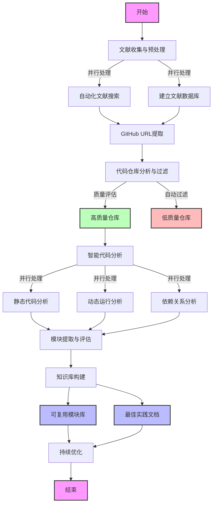

## 概述
SecuriPaperBot 是一个专为计算机信息安全领域设计的爬虫程序，旨在自动化地从顶级学术会议中获取最新的研究论文。该程序支持从IEEE Symposium on Security and Privacy (IEEE S&P)、Network and Distributed System Security Symposium (NDSS)、ACM Conference on Computer and Communications Security (ACM CCS) 以及 USENIX Security Symposium (USENIX Security)等会议上爬取论文。
目前适用于用于从 ACM 数字图书馆下载 ACM 会议论文集。该工具特别适用于需要从特定会议年份获取大量论文的研究人员和学生。目前只针对ccs会议集，后续将更新迭代为四大顶会爬取。

## 功能
- 从指定的 ACM 会议年份下载所有 PDF。
- 自动清理文件名，避免在不兼容的文件系统上出错。
- 支持在内网或代理环境下绕过 SSL 验证。

## 系统要求
- Python 3.x
- `requests`
- `lxml`
- `urllib3`
- 网络接入

## 安装
确保已安装 Python，然后使用以下命令安装所需的包：

```bash
pip install requests lxml urllib3
```

## 使用方法
通过命令行运行脚本，提供会议的年份和您的 ACM 数字图书馆访问点的基本 URL（通常通过大学 VPN）。

```bash
python acm_downloader.py --year '23 --url https://example.com/path/to/library
```
代码里的url是如下图，经过学校图书馆vpn跳转后的ACM期刊网站链接

### 参数
- `year`: 会议的年份，用两位数字格式表示（例如，'21, '22, '23）。
- `--url`: 访问 ACM 数字图书馆的基本 URL，通常根据您的机构订阅或 VPN 设置而有所不同。

## 示例
下载 2023 年 ACM CCS 会议论文集：

```bash
python acm_downloader.py --year '23 --url https://youruniversity.edu/library
```

## 待做


## 许可证
本项目采用 MIT 许可证授权 

## 贡献
欢迎为 `ACM 下载器` 做出贡献。请 fork 本仓库并提交带有您改进的 pull request。


