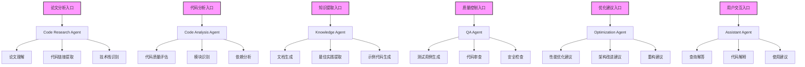

```mermaid
graph TD
    A[论文分析入口] --> B[Code Research Agent]
    B --> B1[论文理解]
    B --> B2[代码链接提取]
    B --> B3[技术栈识别]
    
    C[代码分析入口] --> D[Code Analysis Agent]
    D --> D1[代码质量评估]
    D --> D2[模块识别]
    D --> D3[依赖分析]
    
    E[知识提取入口] --> F[Knowledge Agent]
    F --> F1[文档生成]
    F --> F2[最佳实践提取]
    F --> F3[示例代码生成]
    
    G[质量控制入口] --> H[QA Agent]
    H --> H1[测试用例生成]
    H --> H2[代码审查]
    H --> H3[安全检查]
    
    I[优化建议入口] --> J[Optimization Agent]
    J --> J1[性能优化建议]
    J --> J2[架构改进建议]
    J --> J3[重构建议]
    
    K[用户交互入口] --> L[Assistant Agent]
    L --> L1[查询解答]
    L --> L2[代码解释]
    L --> L3[使用建议]

    style A fill:#f9f,stroke:#333,stroke-width:2px
    style C fill:#f9f,stroke:#333,stroke-width:2px
    style E fill:#f9f,stroke:#333,stroke-width:2px
    style G fill:#f9f,stroke:#333,stroke-width:2px
    style I fill:#f9f,stroke:#333,stroke-width:2px
    style K fill:#f9f,stroke:#333,stroke-width:2px
```